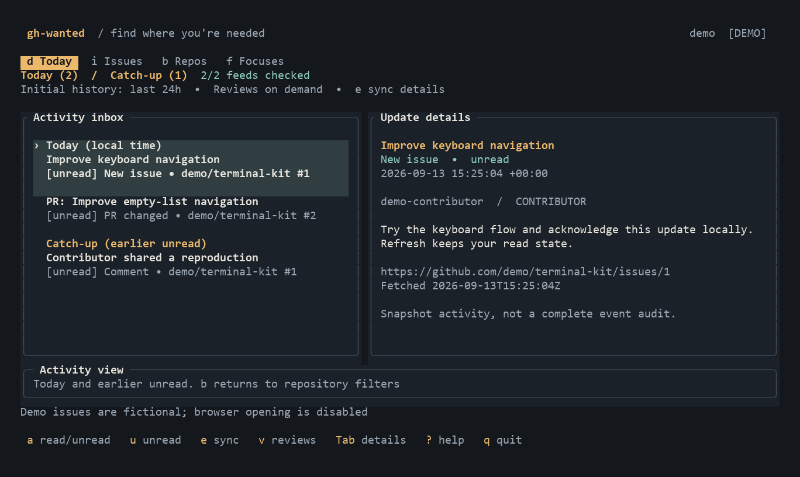

# gh-wanted

**Find where you're needed.**

A terminal app for catching up on watched GitHub repositories and finding issues to contribute to.



## What it does

- **Today:** catch up on issues, comments, PR changes, and reviews. Keep track of what you've read.
- **Issues:** find work by label, keyword, or assignee, updated in the last 7 or 30 days.
- **Repos & Focuses:** organize repositories with private tags and save your favorite filters.

Refresh follows the active tab, pausing and resuming as you move. GitHub access is read-only; tags, saved filters, and read state stay on your machine.

## Get started

Download an archive from [GitHub Releases](https://github.com/cyprx/gh-wanted/releases) for your platform:

| Platform | Archive suffix |
| --- | --- |
| Windows x86_64 | `x86_64-pc-windows-msvc.zip` |
| Linux x86_64 (GNU) | `x86_64-unknown-linux-gnu.tar.gz` |
| macOS Apple Silicon | `aarch64-apple-darwin.tar.gz` |

Extract it and put `gh-wanted` (Windows: `gh-wanted.exe`) in a directory on your `PATH`. No Rust installation is needed. Install [GitHub CLI](https://cli.github.com/) separately, then:

```sh
# Try fictional data without an account
gh-wanted --demo

# Connect to GitHub
gh auth login --hostname github.com
gh-wanted
```

With Rust installed, you can also install from [crates.io](https://crates.io/crates/gh-wanted):

```sh
cargo install --locked gh-wanted
```

GitHub CLI is still required separately. To build a local checkout, run `cargo install --locked --path .` from this repository.
A terminal of **100 × 30** or larger is recommended.

## Controls

| Key | Action |
| --- | --- |
| `d` / `i` / `b` / `f` | Today / Issues / Repos / Focuses |
| `j/k` or arrows | Move through lists or scroll focused details |
| Enter / Esc | Focus details / return to list |
| PgUp / PgDn | Scroll details by page |
| Tab / `o` | Expand details / open in browser |
| `/` / `t` / `s` | Filter / edit local tags / save focus |
| `+` / `x` | Track a repo in Repos / remove local tracking from Repo Details |
| `a` / `u` | Mark activity read or unread / show unread only |
| `r` / `e` | Refresh / show Today sync details |
| `?` / `q` | All shortcuts / quit |

Example filters:

```text
# Repos
topic:rust tag:priority

# Issues
label:"good first issue" unassigned
days:30 label:bug state:open
```

Newly watched repository missing? Press `b`, then `r`. For custom GitHub subscriptions or any accessible repository, press `+` in Repos and enter `owner/repo` or its GitHub URL. Local tracking survives refreshes. Press Enter, then `x` to remove local tracking; GitHub subscriptions stay unchanged, so watched repos remain visible. Adding repositories and browser opening are disabled in demo mode. Releases aren't tracked yet.

## Development

```sh
cargo fmt --check
cargo clippy --locked --all-targets -- -D warnings
cargo test --locked
```

CI checks Linux, Windows, and macOS. To publish, commit the version in `Cargo.toml` and `Cargo.lock`, then push a matching tag:

```sh
git tag v0.1.0
git push origin v0.1.0
```

The workflow checks the version, tests, builds, and publishes the GitHub Release with binary archives and checksums. Existing releases are never replaced. Manual runs of the Release workflow validate builds without publishing.

Contributions welcome—see [CONTRIBUTING.md](CONTRIBUTING.md). Licensed under [MIT](LICENSE).
